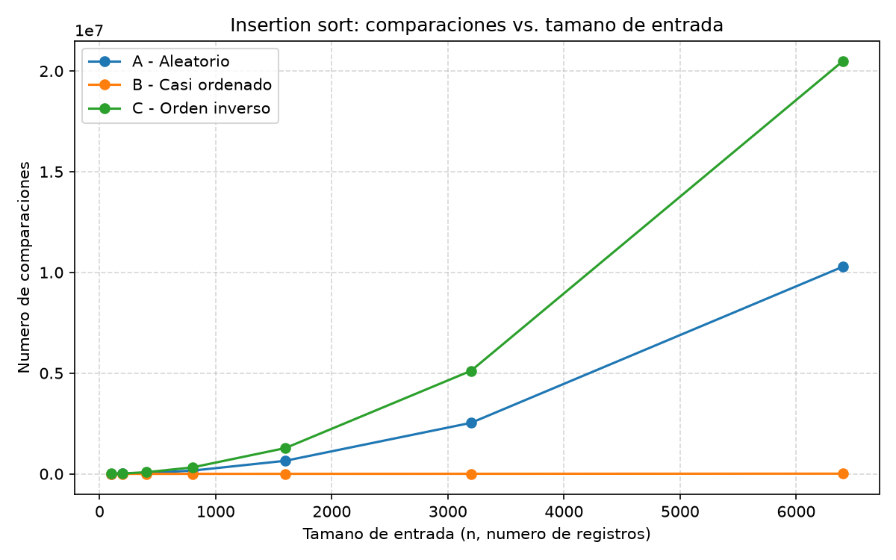
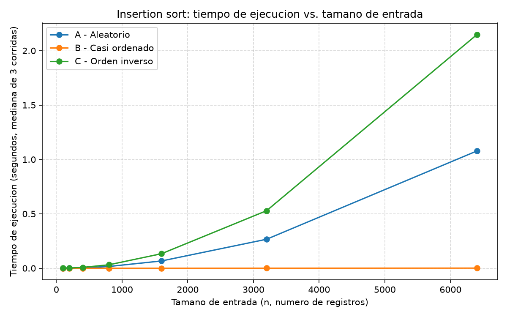
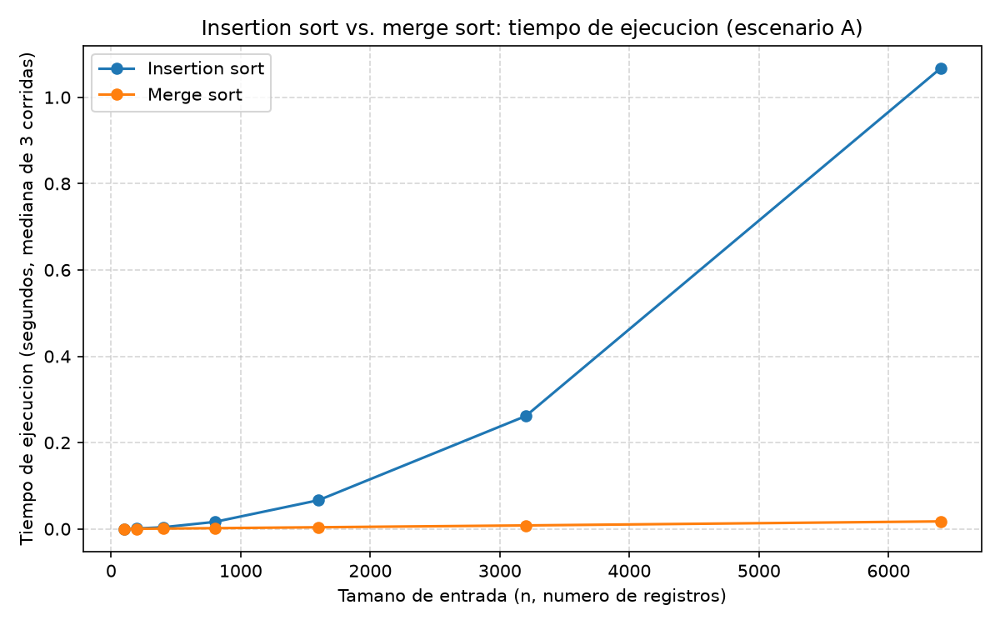

# Laboratorio evaluativo 01: Fundamentos, complejidad y recurrencias

**Autor:** Miguel Arango (miguelarangop36@gmail.com)

## Cómo reproducir el experimento

Desde la raíz del repositorio (`curso-analisis-algoritmos/`):

```bash
.\venv\Scripts\Activate.ps1
pip install -r requirements.txt
cd lab1-fundamentos-complejidad-recurrencias
```

Y para correr cada parte:

```bash
python parte3_casos.py        # Parte 3: peor caso, mejor caso, caso promedio
python parte4_complejidad.py  # Parte 4: insertion sort vs merge sort
```

Cada script imprime en consola el tiempo y las comparaciones por tamaño de entrada, y guarda las gráficas actualizadas en `graficas/`.

---

## Parte 1. Analizar el algoritmo antes de comprar hardware

Que Tamiza lleve ocho años entregando el resultado correcto no dice nada sobre si ese resultado llega a tiempo. Son dos cosas distintas. La corrección tiene que ver con si, dado un lote de registros, el algoritmo produce la lista ordenada por índice de riesgo que se espera: eso insertion sort lo cumple siempre, sin importar cuántos registros le pasen. La eficiencia es otra pregunta: si ese resultado correcto llega dentro de la restricción de recursos que tiene el sistema, en este caso una ventana de cuatro horas (de 2:00 a. m. a 6:00 a. m.) que no se puede mover, porque a esa hora el centro de contacto ya necesita la lista para empezar a llamar. Un algoritmo puede ser perfectamente correcto y aun así incumplir esa restricción de tiempo, y es justo lo que le está pasando a Tamiza: la restricción que incumple es esa ventana nocturna, y ya la incumplió tres veces en las últimas semanas.

La razón de fondo es que insertion sort no escala de forma lineal con el volumen de datos: el número de comparaciones que hace crece con el cuadrado del tamaño del lote. Con 20.000 registros ese costo cuadrático era manejable. Con 1.200.000, que es sesenta veces más volumen, el costo no creció sesenta veces sino aproximadamente sesenta al cuadrado, unas 3.600 veces. Duplicar la velocidad del servidor, en el mejor de los casos, divide ese tiempo entre dos. Contra un costo que se multiplicó por 3.600, una mejora de 2x prácticamente no cambia nada: alivia el síntoma por un tiempo corto y, en la siguiente ampliación del programa, la Secretaría va a estar otra vez comprando servidores más caros para compensar un algoritmo cuyo costo crece más rápido que cualquier mejora de hardware razonable. El problema de fondo no es la velocidad del procesador, es cómo crece el costo del algoritmo con el tamaño de la entrada, y eso solo se arregla cambiando el algoritmo.

Un segundo ejemplo, distinto de Tamiza y de mi propio trabajo: en Nutresa uso SAP para procesos que corren sobre millones de registros, entre ellos la conciliación de movimientos de inventario entre plantas y centros de distribución al cierre de cada período. Ahí también el resultado siempre es correcto, cada movimiento queda cuadrado, pero el proceso tiene que terminar dentro de la ventana de cierre, unas pocas horas antes de que el siguiente turno o el reporte financiero dependan de esos datos. Cuando el volumen crece, más plantas, más referencias, más transacciones por promociones o por fin de mes, ese proceso empieza a rozar el límite de esa ventana, igual que le pasa a Tamiza: el resultado sigue siendo correcto, pero corre el riesgo de no estar listo a tiempo para el paso siguiente.

---

## Parte 2. Responsabilidad ambiental y ética de la implementación

El servidor que corre Tamiza consume energía en proporción al tiempo que el procesador está trabajando: más tiempo de cómputo en el mismo hardware significa más potencia sostenida durante más horas. Con insertion sort ese tiempo deja de ser una franja corta de la madrugada. Como muestro en la Parte 4, para 1.200.000 registros el proceso se estima en el orden de varias horas, con el servidor a carga alta durante buena parte (o toda) la ventana nocturna, y a veces desbordándose hacia el horario diurno. Ese consumo no es un evento aislado, el proceso corre todas las madrugadas, 365 noches al año, mientras la plataforma siga en producción. Una diferencia de minutos por noche, multiplicada por miles de noches, se traduce en un consumo eléctrico acumulado (y una huella de carbono acumulada, según de dónde salga la energía de ese centro de datos) que crece en silencio mientras "todo sigue funcionando". Comprar un servidor más grande no revierte esa tendencia, la empeora, porque ese hardware más potente consume más cada una de esas 365 noches de forma permanente, mientras que corregir el algoritmo reduce directamente el producto tiempo por potencia sin sumar consumo adicional.

En el lado ético hay al menos dos perjuicios concretos. El primero es el paciente de alto riesgo que queda fuera de la lista del día. Cuando el proceso no termina antes de las 6:00 a. m., el centro de contacto trabaja con una lista parcial y sin ordenar por riesgo. Un paciente con un índice altísimo, cuyo registro llegó tarde en el lote o quedó del lado equivocado del corte, puede no ser contactado ese día, retrasando una valoración que se suponía prioritaria. Ahí el que asume el costo es directamente el paciente: un riesgo que el sistema ya había detectado, pero que no se tradujo en una llamada a tiempo. El segundo es el operador del centro de contacto. A las 6:00 a. m. esa persona abre una lista que puede venir incompleta o mal ordenada, sin saber que es así. Llama en un orden que ya no prioriza bien, y cuando alguien pregunta por qué no se contactó a un paciente crítico, el reclamo cae sobre el centro de contacto y no sobre la causa real, que es un algoritmo mal dimensionado. El operador termina cargando con la responsabilidad de un error que no le pertenece.

Hay una tensión propia de este caso que vale la pena nombrar: el orden de la lista decide literalmente a quién se llama primero. Eso impone algo más que terminar a tiempo, el ordenamiento tiene que ser correcto en el orden relativo de los primeros lugares, no solo "completo eventualmente". Un algoritmo que, presionado por el tiempo, se corta a la mitad y entrega una lista parcial no falla de forma neutral: falla concentrando el error justo donde más importa, en la cabeza de la lista, que es la que se usa primero. Por eso la solución no puede ser solo que el proceso termine dentro de la ventana, tiene que terminar produciendo una lista íntegramente ordenada por riesgo, porque una lista a medias no es una versión aceptable del resultado cuando el orden decide quién recibe atención primero.

---

## Parte 3. Peor caso, mejor caso y caso promedio, demostrados en Python

Código de esta parte: [algoritmos.py](algoritmos.py) (`insertion_sort`), [datos.py](datos.py) (generadores de escenarios) y [parte3_casos.py](parte3_casos.py) (el experimento).

### 3.1 Explicación

El peor caso es, sobre todas las entradas posibles de un tamaño fijo `n`, el máximo número de comparaciones o de tiempo que el algoritmo puede necesitar: una cota que ninguna entrada de ese tamaño supera. El mejor caso es, sobre ese mismo conjunto, el mínimo. Y el caso promedio es el promedio, asumiendo una distribución de probabilidad sobre las entradas (normalmente que cada arreglo es igual de probable). Los tres se definen para un tamaño fijo `n` y varían sobre el conjunto de entradas posibles de ese tamaño, no son simplemente "el caso malo" al azar.

Para decidir si el algoritmo entra en producción usaría el peor caso. La ventana de Tamiza es estricta: a las 6:00 a. m. el centro de contacto abre pase lo que pase con el proceso nocturno. Si la decisión se basara en el caso promedio, el sistema quedaría expuesto a que, el día que llegue una entrada desfavorable (por ejemplo una migración que entregue los datos en orden inverso, como el escenario C), el proceso no termine, que es justo lo que ya pasó tres veces. Solo garantizar el peor caso dentro de la ventana asegura que el proceso siempre quepa, sin importar cómo llegue el lote ese día.

Antes de medir, mi predicción es esta: insertion sort compara cada elemento nuevo contra los ya ordenados y lo desplaza hasta su posición, así que el escenario C (orden inverso) debería ser el peor caso, porque cada elemento nuevo se compara y desplaza contra todos los anteriores. El escenario B (casi ordenado) debería ser el mejor caso, porque el 98 % del lote ya viene en el orden que el algoritmo produce y casi no necesita desplazamientos. El escenario A (aleatorio) debería quedar cerca del caso promedio, al no tener ninguna estructura particular.

### 3.2 Demostración experimental





Con `n = 6400` (mediana de 3 corridas):

| Escenario | Comparaciones | Tiempo (s) |
|---|---|---|
| A. Aleatorio | 10.276.753 | 1.0718 |
| B. Casi ordenado | 10.649 | 0.0012 |
| C. Orden inverso | 20.476.800 | 2.1268 |

El escenario C resultó ser el peor caso y el B el mejor, tal como predije. El escenario A queda cerca del caso promedio: sus comparaciones son casi la mitad de las de C en cada tamaño (10.276.753 contra 20.476.800 en `n = 6400`), lo cual tiene sentido porque en promedio un elemento aleatorio se desplaza hasta la mitad del prefijo ya ordenado en vez de hasta el inicio. Como dato curioso, el valor medido en C, 20.476.800, coincide exactamente con `n(n-1)/2 = 6400 × 6399 / 2`, la fórmula cerrada del peor caso de insertion sort.

Hay un matiz en el escenario B que vale la pena aclarar: el mejor caso teórico de insertion sort es una entrada que ya viene completamente ordenada en el sentido que el algoritmo produce, y eso exige exactamente `n - 1` comparaciones. El escenario B no es ese caso exacto (tiene 10.649 comparaciones en `n = 6400`, no 6.399) porque el 2 % final sí está desordenado y necesita desplazamientos. Aun así se aproxima mucho más al mejor caso que A o C, porque solo esa fracción pequeña del lote requiere trabajo real.

---

## Parte 4. Complejidad de merge sort e insertion sort: cálculo y validación

Código de esta parte: [algoritmos.py](algoritmos.py) (`merge_sort`) y [parte4_complejidad.py](parte4_complejidad.py) (el experimento comparativo).

### 4.1 Cálculo teórico

La recurrencia de merge sort es `T(n) = 2T(n/2) + Θ(n)`. Cada término sale de dividir el problema en dos mitades y después combinarlas: el 2 porque cada llamada genera dos subproblemas (mitad izquierda y mitad derecha), `T(n/2)` porque cada subproblema tiene tamaño n/2 (se parte exactamente a la mitad), y `Θ(n)` porque combinar, es decir mezclar las dos mitades ya ordenadas en una sola lista, recorre una sola vez el total de los n elementos: por cada elemento que entra a la lista mezclada se hace como mucho una comparación entre el frente de las dos sublistas.

La resuelvo con árbol de recursión:

```
Nivel 0:                    n                              costo: c*n
                            / \
Nivel 1:               n/2      n/2                        costo: 2 * c*(n/2)     = c*n
                       /  \      /  \
Nivel 2:            n/4  n/4  n/4  n/4                      costo: 4 * c*(n/4)     = c*n
                     ...                ...
Nivel i:        (2^i subproblemas de tamaño n/2^i)          costo: 2^i * c*(n/2^i) = c*n
                     ...                ...
Nivel log2(n):  (n subproblemas de tamaño 1)                costo: n * c*(1)       = c*n
```

En cada nivel el costo total es `c*n`, sin importar el nivel: al bajar uno, el número de subproblemas se duplica y el tamaño de cada uno se reduce a la mitad, y esos dos efectos se cancelan entre sí. La recursión llega al caso base (tamaño 1) cuando `n / 2^i = 1`, es decir cuando `i = log2(n)`. Contando el nivel 0, hay `log2(n) + 1` niveles en total.

Costo total = costo por nivel × número de niveles = `c*n × (log2(n) + 1) = c*n*log2(n) + c*n`. El término que domina es `c*n*log2(n)`, así que T(n) = Θ(n log n).

Para insertion sort calculo la cota línea a línea, usando la implementación de [algoritmos.py](algoritmos.py) (versión descendente) y llamando `tᵢ` al número de veces que se evalúa la condición del while para la posición i, que equivale al número de elementos que hay que revisar antes de insertar la clave:

| Línea | Costo por ejecución | Veces que se ejecuta |
|---|---|---|
| `for i in range(1, n):` | c₁ | n |
| `clave = resultado[i]` | c₂ | n − 1 |
| `j = i - 1` | c₃ | n − 1 |
| `while j >= 0:` (control) | . | n − 1 |
| `if resultado[j] < clave:` (comparación) | c₄ | Σ tᵢ |
| `resultado[j+1] = resultado[j]; j -= 1` | c₅ | Σ (tᵢ − 1), cuando hay desplazamiento |
| `resultado[j+1] = clave` | c₆ | n − 1 |

En el mejor caso, cuando la entrada ya viene en el orden que produce el algoritmo, la condición del while se evalúa una sola vez por posición y es falsa de inmediato (tᵢ = 1, sin desplazamientos). Sumando queda `T(n) = c₁n + (c₂+c₃+c₄+c₆)(n-1)`, que es lineal en n: Θ(n).

En el peor caso, con la entrada en orden exactamente contrario, cada clave se compara y desplaza contra las i posiciones anteriores (tᵢ = i). La suma `Σ i = n(n-1)/2` domina el resultado y la función termina siendo cuadrática: Θ(n²).

En el caso promedio, con una entrada aleatoria, cada clave se desplaza en promedio hasta la mitad del prefijo ya ordenado (tᵢ ≈ i/2), así que la suma sigue siendo del orden de n², con una constante más chica que en el peor caso: también Θ(n²).

| Algoritmo | Mejor caso | Caso promedio | Peor caso |
|---|---|---|---|
| Insertion sort | Θ(n) | Θ(n²) | Θ(n²) |
| Merge sort | Θ(n log n) | Θ(n log n) | Θ(n log n) |

### 4.2 Validación experimental



Tiempos medidos sobre el escenario A (mediana de 3 corridas):

| n | Insertion sort (s) | Merge sort (s) |
|---|---|---|
| 100 | 0.000251 | 0.000167 |
| 1.600 | 0.066490 | 0.003904 |
| 6.400 | 1.070307 | 0.017794 |

La curva de insertion sort crece claramente cuadrática: al multiplicar n por 64 (de 100 a 6.400) su tiempo se multiplica por casi 4.300, muy cerca de 64² = 4.096. La de merge sort crece mucho más suave: para el mismo salto de n su tiempo se multiplica solo por ~107, consistente con el crecimiento n log n esperado (64 × log2(6400)/log2(100) ≈ 122, del mismo orden de magnitud). Desde n ≈ 800 la separación entre las dos curvas ya se nota a simple vista en la gráfica y sigue abriéndose con cada tamaño siguiente.

Esto coincide con lo que calculé en 4.1: Θ(n²) contra Θ(n log n) predice exactamente este comportamiento, una curva que se dispara y otra que casi no se despega del eje horizontal. Lo único que no sigue el patrón típico (donde merge sort suele partir más lento que insertion sort en tamaños chicos, por el costo fijo de crear sublistas y llamadas recursivas) es que en mis mediciones merge sort ya es más rápido desde n = 100. La explicación más probable es que, incluso ahí, el número de comparaciones de insertion sort en el escenario aleatorio (2.542) ya es un orden de magnitud mayor que el de merge sort, así que el costo cuadrático le gana al costo fijo de la recursión desde un tamaño bastante chico en esta máquina.

### 4.3 Concepto técnico a la Secretaría de Salud

Para el equipo de ingeniería de la Secretaría de Salud, sobre la Plataforma Tamiza.

Mi recomendación es reemplazar insertion sort por merge sort como único algoritmo de ordenamiento del proceso nocturno, para los tres canales de entrada sin distinción.

El criterio detrás es el mismo que usé para decidir qué caso mirar en la Parte 3: si el canal de entrada puede cambiar sin aviso, la decisión no se puede apoyar en el comportamiento favorable de un escenario particular como el casi ordenado B, porque ese comportamiento depende de un supuesto operativo (que el reproceso siga partiendo de la lista de ayer) que no está garantizado hacia el futuro. Insertion sort es rápido en B y catastrófico en C, su desempeño es una lotería según cómo llegaron los datos ese día. Merge sort tiene el mismo costo Θ(n log n) sin importar el orden de entrada, y mis mediciones lo confirman: 0,0178 s en el escenario aleatorio para n = 6.400, sin necesidad de detectar de antemano qué escenario está llegando ni de mantener una implementación por canal.

Sobre si cabe en la ventana de cuatro horas con 1.200.000 registros: esto es una estimación, no la medí directamente, la obtengo extrapolando la forma de cada curva de la gráfica de la Parte 4 desde n = 6.400. Insertion sort es Θ(n²): n se multiplica por ≈187,5 y el tiempo por ≈187,5² ≈ 35.156. Partiendo del peor caso medido (2,1268 s en C) da ≈ 20,8 horas; partiendo del aleatorio (1,0718 s) da ≈ 10,5 horas. Los dos muy por encima de las 4 horas disponibles, consistente con las tres veces que el proceso real no terminó a tiempo. Merge sort es Θ(n log n): el tiempo se multiplica por ≈187,5 × (log2(1.200.000)/log2(6.400)) ≈ 299,4. Partiendo de los 0,0178 s medidos da ≈ 5,3 segundos. Aunque a esa escala el costo real fuera diez veces peor por efectos de memoria y hardware que no capturo con n = 6.400, seguiría siendo del orden de un minuto, muy por debajo de la ventana.

Sobre la propuesta de duplicar la velocidad del servidor: no la recomiendo como solución de fondo. Duplicar la velocidad de reloj, en el mejor caso, divide el tiempo entre dos. Aplicado al peor caso de insertion sort (20,8 horas), el resultado sería de todas formas ≈ 10,4 horas, el doble de la ventana disponible. El dato que sostiene esto es el mismo n = 6.400 de la Parte 4: insertion sort tarda 1,07 s contra 0,018 s de merge sort en la misma máquina, sin comprar nada, una diferencia de ~60x que ninguna mejora de hardware razonable iguala.

Una consideración más allá del tiempo: merge sort necesita memoria adicional del orden de Θ(n) para las sublistas temporales que arma durante la mezcla, frente al Θ(1) de insertion sort. Con 1.200.000 enteros esa memoria extra es acotada y previsible. También vale la pena dejar registrado que la ventaja de insertion sort en B depende de que el reproceso siga generando lotes casi ordenados; si ese flujo cambia, insertion sort pierde su único escenario favorable y queda expuesto en los tres canales por igual. Migrar a merge sort elimina esa dependencia de raíz.
